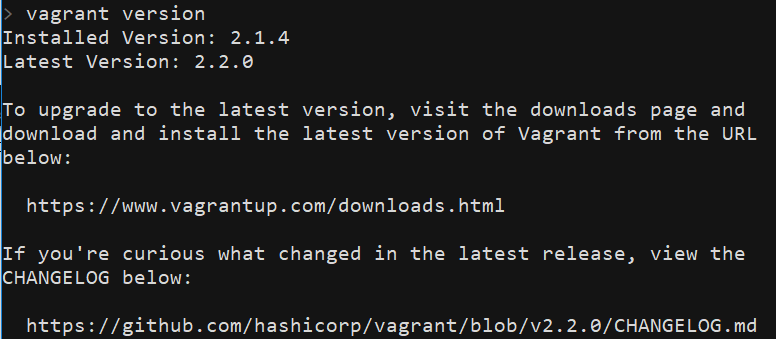
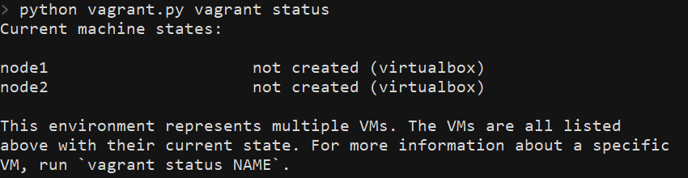
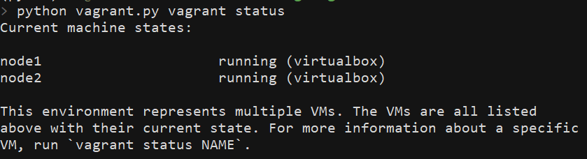
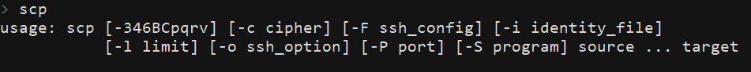
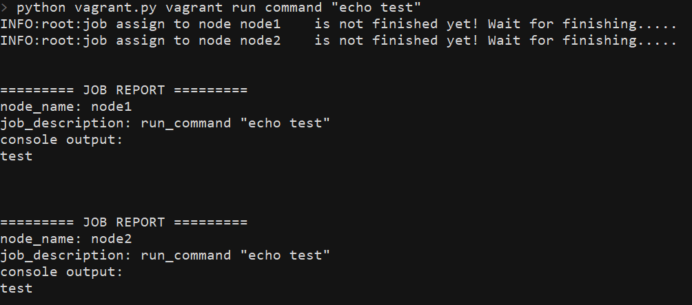
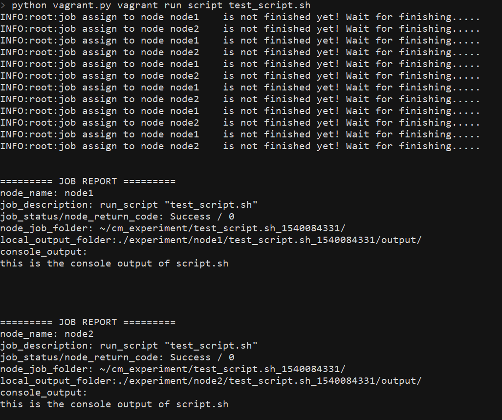

 

# ehvagrant: enhanced *Vagrant* interface

[TOC]

----

## Introduction

[Vagrant](https://www.vagrantup.com/) is a open-source software that help users to build and manage virtual machines through command line interface. Built upon Vagrant,`ehvagrant`provide you an *enhanced* command line interface that enable users to utilize Vagrant functionalities *in an earlier way*. 

`ehvagrant` itself, in essence, is an pip-installable python script. But thanks to the "entry_points" functionality supported by [setuptools](https://github.com/pypa/setuptools), we can easily use this script as if it is a "real" command line application. 

The major enhancement of `ehvagrant` is that it enables you to execute the same job on multiple Vagrant instances at the same time, including:

- transfer file and folder between host machine and instances

- execute command or script on instances.

This allows you to test a program on multiple virtual machines, which may have different OS and working environment, at the same time, by just issuing a **single** command. 


-----

## Setup Walkthrough

### 0. Setup requirements summary

Minimum  requirements to use`ehvagrant`are the following:

- Python 3  and `pip`should be available on the host machine.
- A working Vagrant software which works with appropriate [virtualization provider](#Install-*virtualization-provider*).
- `scp` functionality should be available on the host machine.
- Currently, `ehvagrant ` just support the virtual machines running an Unix-like OS, such as Ubuntu.

### 1. Setup `ehvagrant` 

Just `pip install ehvagrant`. 

### 2. Install vagrant

You can download Vagrant from [here](https://www.vagrantup.com/downloads.html). It supports all mainstream operating system, including Windows, Mac OS, and various Linux distribution.  After finishing installation, you can check if the installation successful by executing the command `vagrant version`.  You should see something like below.



### 3. Install *virtualization provider*

Although Vagrant *help* you with virtual machine managements, Vagrant does not *handle* the task of virtualization itself. Vagrant rely on virtualization software or even cloud service provider to do the actual work of *virtualization*. In other word, to leverage Vagrant functionality**, you need to install Vagrant along with *virtualization provider* and/or the correspondent *Vagrant plugin*** that enables Vagrant to interact with the virtualization provider.

The default virtualization provider of Vagrant is [VirtualBox](https://www.virtualbox.org/). You don't have to install any plugin to let Vagrant work with VirtualBox. However, you need to install VirtualBox if it don't exist on your host computer. In this case, please refer to [VirtualBox downloand page](https://www.virtualbox.org/wiki/Downloads). Also, please note that using VirtualBox as the virtualization provider implies the virtual machines you manages through Vagrant will run on your host machine. So make sure there are sufficient resources on your host machine for the virtual machines to use. 

You may choose some other virtualization provider. In this case, please setup virtualization provider of your choice and follow the [Vagrant user manual]('https://www.vagrantup.com/docs/providers/')  to setup Vagrant with correspondent plugin. If there is no special need that you need to address to, we strongly recommend you just go with VirtualBox.

### 4. Configure `Vagrantfile`

`Vagrantfile` is the main configuration file of Vagrant. Vagrant will only interact with the virtual machines specified in the `Vagrantfile`. 

To utilized `ehvagrant`, `Vagrantfile` should be stored at`VAGRANTFILE_PATH`which the default path is  `~/ehvagrant/Vagrantfile`. You can also define a environment variable `EHVAGRANT_HOME`, which will make your default `VAGRANTFILE_PATH` become `{EHVAGRANT_HOME}/Vagrantfile` .

`ehvagrant` will try to locate `Vagrantfile` every time it is invoked. If `ehvagrant` can't find the `Vagrantfile`, it will create one at the default path. Default `Vagrantfile` defines two Ubuntu virtual machine called `node1` and `node2`, powered by VirtualBox.  

You can use [ehvagrant create](#create-instances) command to easily setup a `Vagrantfile` which defines any amount of virtual machine as you want. Moreover,  you can also try to customize your own `Vagrantfile`. Please refer to [Vagrant user manual](https://www.vagrantup.com/docs/vagrantfile/) to see how to do that. Don't forget that currently `ehvagrant` just supports Unix-like OS, and after finishing your modification on `Vagrantfile`, save it to the `VAGRANTFILE_PATH`.  

 The following walkthrough assumes you go with the generated default `Vagrantfile`.

### 5. Initialize virtual machine

After finishing `Vagrantfile` creation,  you are now ready to deploy and run your virtual machine with Vagrant. But first, let us check current status of your Vagrant project. Execute `ehvagrant info`at `ehvagrant`root directory, you will see: 



Then execute `ehvagrant start`. Since your machines are not deployed yet, Vagrant will first deploy your machines and then bring them up, and automatically do LOTS of setting.  When Vagrant has done its work, we can confirm this by issuing `ehvagrant info` again. You will see now:



HOO-WA! Your two virtual machines are painlessly deployed, configured, up and running! Now you are ready to do some fancy work with Vagrant and `ehvagrant`.

### Micellouenes: setup `scp` on the host machine

Since the topic is not directly relate to `ehvagrant`, here I just shortly describe how to `scp` is working properly. Open terminal and execute `scp`, you should see a short usage guide shows on your screen. If it is not there, please install `scp` and make the path of its executable exists in your `PATH` variable. 



### Note: setup `ehvagrant` with `cloudmesh`

`ehvagrant` was originally developed as a module of `cloudmesh`. If you get `ehvagrant` with `cloudmesh` distribution,  the following point will be changed:

- You don't have to install`ehvagrant` separately from `cloudmesh`.  When `cloudmesh` sets up, it automatically has`ehvagrant` with it.

- Your `VAGRANTFILE_PATH` now change to `~/.cloudmesh/vagrant_workspace/Vagrantfile`.

----------------


## Manage Virtual Machines with `ehvagrant`

### Basic concept

#### Which instance(s) will be affected by my command?

Commands will only affect the virtual machine instances that defines in the current Vagrant environment, which in return is defined by the `Vagrantfile` locates at `VAGRNANTFILE_PATH`. Instances are identified by its name.

#### How to specify instances I want to work with?

Use`--vms=<vmList>` option to specify which instances you want to work with. `<vmList>` string will be parsed by [python-hostlist](https://www.nsc.liu.se/~kent/python-hostlist/) package. Here are some example show how your `<vmList>` string will be parsed:

```
>>> hostlist.expand_hostlist('a,b,c')  # --vms=a,b,c
['a', 'b', 'c']

>>> hostlist.expand_hostlist('node[1-5]') # --vms=node[1-5]
['node1', 'node2', 'node3', 'node4', 'node5']
```

Most of commands can work without `--vms`. But be careful, issuing a command without specifying instances will usually affect **all** of the instances that are available in the current vagrant environment.

#### Before Start

Before transferring file and folder between host and instances or running commands and scripts on instances, make sure that all of the instances you want to work with are **up,  running, and reachable through network.** 

### Manage instances

#### create instances

Usage: `ehvagrant create --vms=<vmList> [--image=IMAGE] [--output=OUTPUT] `

Generate a `Vagrantfile` that defines multiple instances. **This functionality can only define instances working with VirtualBox**. 

You should use `--vms=<vmList>` argument to specify the list of the names for the instances. See [here](#How-to-specify-instances-I-want-to-work-with?) to know how to.

If you don't specify an virtual machine`IMAGE`, `ehvagrant` will use  [Ubuntu/trusty64](https://app.vagrantup.com/ubuntu/boxes/trusty64) as its default image. If you specify an  `IMAGE` that is in the list given by `vagrant box list` command, Vagrant will define the the instances using the local image. Otherwise, it will try to search [Vagrant Cloud](https://app.vagrantup.com/boxes/search) and download the image.

Use `--output` argument to specify the output path for generated `Vagrantfile`. If you don't specify `--output` path, created`Vagrantfile` will be save to `VAGRNATFILE_PATH` **and replace the original file saved there**. 

#### start up instances

Usage :`ehvagrant start [--vms=<vmList>]`

Start up the stopped or suspended instances.

#### stop instances

Usage:`ehvagrant stop [--vms=<vmList>]`

Shut down instances. Any unsaved data will be lost. 

#### suspend instance

Usage: `ehvagrant suspend [--vms=<vmList>]`

Save the current state of instances and then stop then. Unsaved data will not be lost and user can restore the current state and continue to work latter on.

#### destroy instances

Usage:```ehvagrant destroy [--vms=<vmList>]```

Destroy instances. The data stored on the instance will be lost.

#### show current status of instances

Usage: `ehvagrant info`

Show the status of all Vagrant instances belonging to the current environment. 

###  Transfer file and folder between host and instances

- The following functionality are implemented by utilizing `scp ` command. [As previously mentioned](#Micellouenes:-setup-python-3-and-`scp`-on-host-machine), please make sure `scp` functionality is available on your host machine.
- If you specify a folder as the target to be uploaded/downloaded, all of its contents will be get uploaded/downloaded.
- **To specify a folder, just put a `/` in the end of the path string**. For example, `A/smaple/folder/string/`;  Or use `-r` flag to indicates the target is a folder. 

#### upload file or folder (i.e.,from host to instances)

Usage:`ehvagrnat upload --from FROM --to TO [-r] [--vms=<vmlist>]`

Upload file or folder from host machine to the instances.

#### download file or folder (i.e., from instances to host)

Usage:`ehvagrnat download --from FROM --to TO [-r] [--vms=<vmlist>]`

If  you are trying to download file or folder from two or more instances simultaneously,  data will be parallelly downloaded and be separately stored in a folder which names after the instances'`name` . 

For example, if user try to download `~/foo.txt` simultaneously from `node1` and `node2`, and designate `./bar/foo.txt` as the host file path, then `ehvagrant ` will automatically modify the host file path, copy `~/foo.txt` on `node1` into `./bar/node1/foo.txt` and copy `~foo.txt`on `node2` into `./bar/node2/foo.txt`.

### Execute arbitrary shell command or script on instances

#### start a ssh session

Usage: `ehvagrant ssh NAME`

Launch a secure-shell session which connects to the vagrant instance specified by ```NAME```.

#### run arbitrary shell command

Usage:`ehvagrant run command COMMAND [--vms=<vmList>]`

Run an arbitrary shell `COMMAND` on instances. If user specify multiple instances to run, the command will run on those instances simultaneously, i.e., in the parallel fashion.  Any output write to the `stdout` and `stderr` of executing instances will be fetched and reformatted to a job report and print out to the current terminal.



#### run arbitrary shell script

Usage: `ehvagrant run script SCRIPT [--data=PATH][--vms=<vmList>]`

Run an arbitrary shell script on the instances. The behavior of this command will comply with `run command`, plus extra features defined as following:

- positional argument `SCRIPT` is the path of the script file to be executed, which must locates on the host machine. It will be uploaded and stored at the `JOB_FOLDER` of all executing instances, which locates at` ~/cm_experiment/{script_name}_{epoch_second}/`.
- If there is any data that must be run against the script, specify the path of the data (may be a file or a folder) with `--data` argument.  The data will be copied into `{JOB_FOLDER}/data/` directory of all executing instances.
- some note about the script programming:
  - If the script will ever produce any output file, it should be stored at `$JOB_FOLDER/output/` directory. **This behavior**, including building the `$JOB_FOLDER/output/` folder and storing result file to that folder, **should be handle by the script itself**.
  - When execution, the script will receive`JOB_FOLDER` as its first argument. This value can be used in various ways. For example, to build the `$JOB_FOLDER/output/` folder.
- After execution, if there exist anything in ` $JOB_FOLDER/output/`, then it will all be fetched and stored to `~/experiment/{instnace_name}/{script_name}_{epoch_second}/output/` folder on the host machine.
  - If you have set `EHVAGRANT_HOME` environment variable, then the fetched output will be saved to `$EHVAGRANT_HOME/{instnace_name}/{script_name}_{epoch_second}/output/`
  - If you use `ehvagrant` with `cloudmesh`, the output content will be stored at `$CLOUDMESH_ROOT_DIRECTORY/experiment/{instnace_name}/{script_name}_{epoch_second}/output/`. 
- Finally, execution reports will be printed out to current terminal

